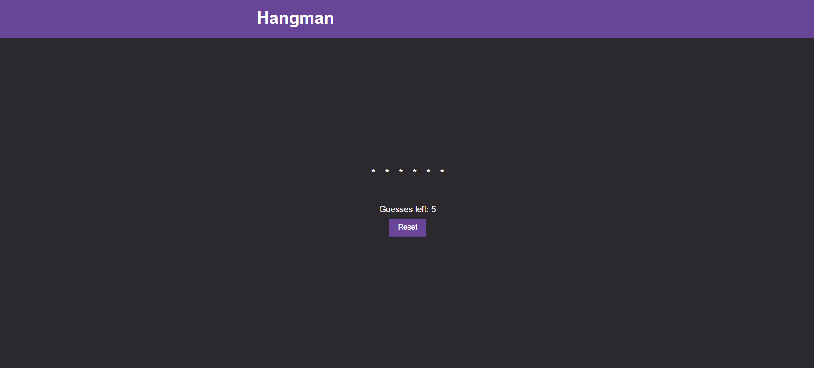

# HangmanApp

A simple Hangman game built with HTML, CSS and JavaScript.  
Users can guess letters to reveal a hidden word. The game tracks remaining guesses and determines win or lose state.

## Preview

<p align="center">
  
</p>

## Screenshots

### Game Screen


## Features

- Random word selection from a predefined list
- Keyboard-based letter input
- Remaining guesses counter
- Win and lose game states
- Reset button to start a new game
- Clean UI with header layout

## Technologies Used

- HTML5
- CSS3
- Vanilla JavaScript

## Disclaimer

This project is for learning purposes and is based on an Udemy tutorial.

## Project Structure

```bash
HangmanApp/
├── index.html
├── scripts/
│   ├── app.js
│   └── hangman.js
├── styles/
│   └── styles.css
└── images/
    ├── favicon.jpg
    └── hangman-preview.png

